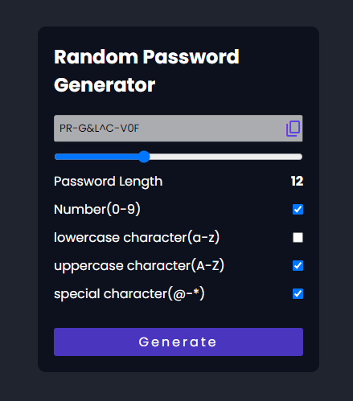

---

# Random Password Generator

This is a simple yet powerful **Random Password Generator** tool built as part of the **Kuro-no-Sekai** repository. The application allows users to generate secure and customizable passwords by specifying the length and types of characters to include.

## Features

- **Customizable Length:** Select password lengths between 1 and 32 characters.
- **Character Selection:** Include or exclude:
  - Numbers (0-9)
  - Lowercase letters (a-z)
  - Uppercase letters (A-Z)
  - Special characters (~!@#$%^&*)
- **Clipboard Functionality:** Easily copy the generated password to your clipboard with a single click.

## Technologies Used

- **HTML5:** For the structure of the web page.
- **CSS3:** For styling the page, including custom checkboxes and responsive design.
- **JavaScript:** For password generation logic and clipboard functionality.

## Getting Started

### Prerequisites

- A web browser (such as Chrome, Firefox, Safari, etc.).

### Installation

1. Clone the **Kuro-no-Sekai** repository from GitHub:
   ```bash
   git clone https://github.com/nayalsaurav/Kuro-no-Sekai.git
   ```

2. Navigate to the `random-password-generator` folder (or relevant directory containing the files).

3. Open the `index.html` file in a web browser to view and select the random password generator project.

### Usage

1. Open the project in a web browser.
2. Use the **slider** to adjust the desired password length.
3. Check or uncheck the boxes to specify the types of characters (numbers, lowercase, uppercase, special characters) you'd like in the password.
4. Click the **Generate** button to create a new password.
5. Click the **Copy** button (icon) to copy the generated password to the clipboard.
6. The "Copied!" message will appear briefly after copying the password.

## Screenshots

Here’s a screenshot of the Random Password Generator interface:





## Code Snippet

Here’s a small snippet of how the password generation logic works in the JavaScript file:

```javascript
function generatePassword() {
    let selectedStrings = "";
    let currentPassword = "";

    selectedStrings += upperCase.checked ? uppercaseString : "";
    selectedStrings += lowerCase.checked ? lowercaseString : "";
    selectedStrings += number.checked ? numberString : "";
    selectedStrings += specialChar.checked ? specialCharString : "";

    if (selectedStrings.length === 0) {
        alert("Please select at least one character type.");
        return "";
    }

    let currSize = paswordLength.value;
    for (let i = 0; i < currSize; i++) {
        currentPassword += selectedStrings.charAt(Math.floor(Math.random() * selectedStrings.length));
    }
    return currentPassword;
}
```

## Contributing

Contributions are welcome! To contribute to this project, follow these steps:

1. Fork the repository.
2. Create a new branch for your feature or bug fix (`git checkout -b feature-branch`).
3. Make your changes and commit them (`git commit -m 'Add new feature'`).
4. Push to your branch (`git push origin feature-branch`).
5. Open a Pull Request on the original repository.

## License

This project is licensed under the MIT License. See the [LICENSE](LICENSE) file for more details.

## Acknowledgements

- **Icons:** [Material Icons](https://material.io/resources/icons/)
- **Fonts:** [Google Fonts - Poppins](https://fonts.google.com/)
- **Inspiration:** Various password generators inspired the design and logic.

## Contact

For any issues or inquiries, feel free to open an issue on the [GitHub repository](https://github.com/nayalsaurav/Kuro-no-Sekai.git).
